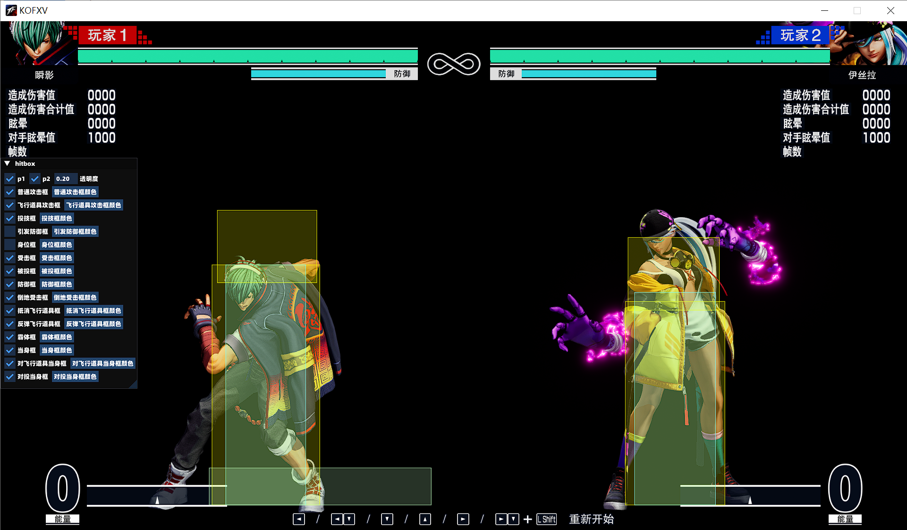
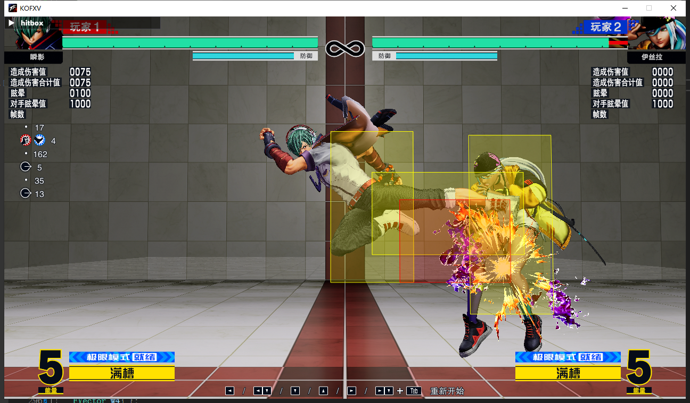

# hitbox

拳皇15判定框显示

## 判定框

**已完成**

- 攻击框
- 身体框
- 受击框
- 防御框
- 追加框
- 霸体框
- 当身框

- 投技框
- 被投框
- 触发防御框
- 抵消飞行道具框
- 反弹飞行道具框

## 更新

#### **2.0**

- 修复了角色位移导致攻击框显示不准的问题(江璃落子鹓)
- 新增投技框、被投框、触发防御框、抵消飞行道具框、反弹飞行道具框(江璃落子鹓)

#### 3.0

- 添加透明度选项
- 使用填充矩形绘制判定框

#### 3.5
- 修复坂崎良2D判定框显示错误Bug
- 新增对投当身框、对飞行道具当身框
- 抵消飞行道具框和反弹飞行道具框新增在框中央显示可抵消或反弹的飞行道具等级

## 使用

在[发布页](https://github.com/Moon-night-Fragment/hitbox/releases)中下载`launcher.exe`

启动游戏

启动`launcher.exe`

## 编译

Virtual Studio 2022

## 感谢

感谢[Redundantcy(bilibili.com)](https://space.bilibili.com/107436250)提供源代码和修改教程
